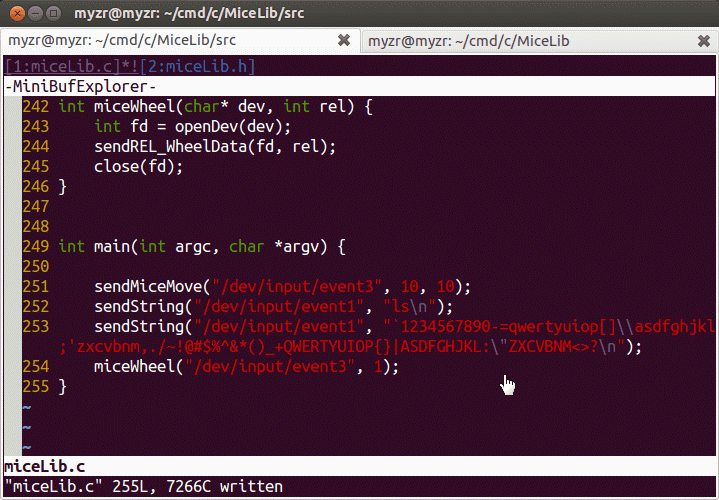

# MiceLib

这是一个模拟鼠标、键盘的库，从中我们可以知道像按键精灵、TeamViewer这些工具的背后的运作原理，当然当前的库目标不在此，否则的还要加上网络编程和桌面图像获取以及传输。

## 思路来源

写这个库的原因是考虑到将来做测试的时候，可以进行远程模拟测试，人不一定要在主机旁边，只需要进行远程操作就可以了，譬如：借助Android手机来对硬件测试进行测试，这样可以在缺少Touch的情况下对系统进行测试。

## 软件运行效果

## Author

[曾剑锋](http://www.cnblogs.com/zengjfgit/)
